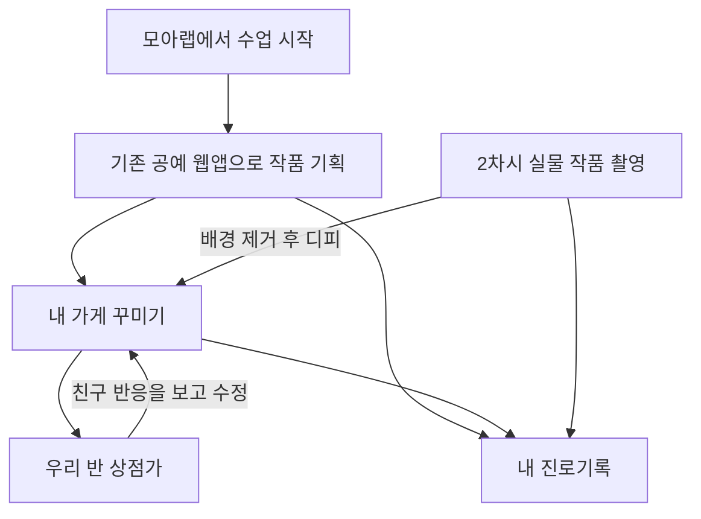
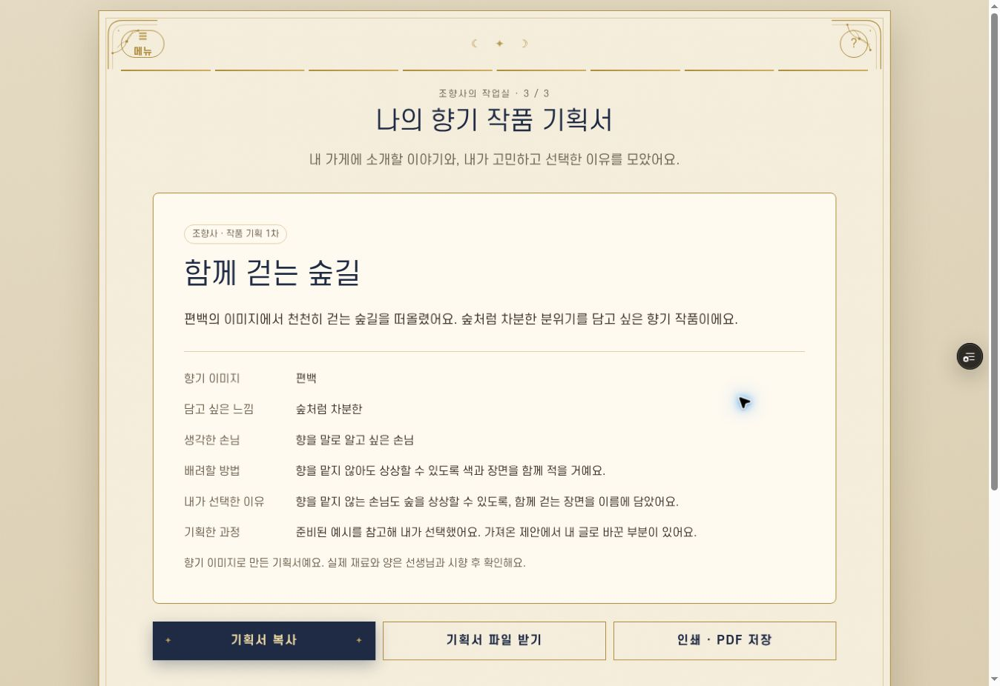

# 조향사 작품 기획과 모아랩 연결

## 공통 수업 흐름



| 구간 | 역할 | 이번 변경 |
| --- | --- | --- |
| 모아랩 수업 시작 | 반·수업·학생 참여 관리 | 기존 aiapp 유지 |
| ai-smell 작품 기획 | 타로 영감 → 손님·느낌·향 → 이름·소개·배려·선택 이유 | 구현 |
| 내 가게와 상점가 | 작품 전시, 친구 반응, 수정 | aiapp 연결 후 진행 |
| 진로기록 | 기획·수정·실물 제작 과정을 기록 | 자동 전송은 아직 없음 |
| 실물 작품 사진 | 2차시 촬영, 배경 제거, 전시 | 후속 작업 |

타로는 기존 공예 웹앱의 도입 활동이다. 타로의 개인 고민이나 채팅을 가게에 공개하지 않는다. 기획서에는 학생이 직접 고르고 확정한 작품 설명과 선택 이유를 담는다. 다른 공예도 도입 활동은 각각 유지하고, 기획 결과의 공통 구조로 모아랩에 연결한다.

## 현재 학생 동작

1. 기존 감정 색·주제·세 카드·리딩·향 추천을 진행한다.
2. ‘이 향기로 작품 기획하기’에서 손님, 작품 분위기, 향기 이미지를 정한다. 실제 향은 시향 후 결정해도 된다.
3. 직접 쓰거나 AI의 두 제안/준비된 예시를 참고해 이름·소개·배려 방법을 정하고, 선택 이유는 직접 쓴다.
4. 기획서를 완성하고 다시 수정할 수 있다. 복사, UTF-8 텍스트 파일, 인쇄/PDF 저장을 제공한다.

화면은 모아랩 자동 연결이 준비 중이라고 표시한다. 현재 버튼은 서버의 진로기록 저장이나 상점 개설을 실행하지 않는다. 기획서 확정 후 내용이 바뀌면 다시 확정할 때 차수를 올린다.

## AI와 재료

- `POST /api/plan`은 선택한 손님 ID, 분위기 ID, 향기 이미지 이름만 받는다. 입력 목록과 길이를 서버에서 검사한다.
- 기존 `ANTHROPIC_API_KEY` 서버 환경변수를 사용한다. 새 기획 기능은 브라우저에 저장된 API 키를 읽거나 보내지 않는다. 기존 타로의 개인 키 설정은 이번 변경 범위에 포함하지 않았다.
- 모델은 기존 앱과 같은 `claude-haiku-4-5-20251001`. 출력 상한 800토큰, 서버 대기 12초, 클라이언트 대기 16초다.
- AI 미설정, 연결 실패, 시간 초과, 잘못된 응답에는 준비된 예시를 반환하며 AI 생성과 구별해서 표시한다. 선택 버튼을 누르기 전에는 학생이 작성한 글을 덮어쓰지 않는다.
- 활동당 AI 버튼 두 번 제한은 수업 UX 제어다. 서버 사용량 인증/과금 제한이 아니다. API는 기존 앱과 같이 공개이며, 서버 키의 공급자 한도는 운영 설정을 따른다.
- 향 목록은 영감을 위한 개념이다. 실제 키트가 확인됐다고 간주하지 않는다. 제조법·배합 비율·의학적 효과를 생성하도록 요청하지 않는다. 실제 재료·양은 강사가 승인한 키트와 시향으로 결정한다.

## 임시 저장과 연결용 결과

`sessionStorage`의 `moalab.scent-plan.v1`에 현재 기획만 보관한다. 12시간 지난 임시 기획은 버리고, 새로고침 후에는 표지의 ‘내 기획 이어하기’를 눌러야 내용이 열린다. ‘새 활동’은 임시 기획과 기존 타로/채팅 메모리를 초기화한다. 저장이 차단된 브라우저에서는 안내하고 파일로 받을 수 있다. 서버 저장이나 다른 기기 동기화는 아니다.

기획 확정 후 `ScentPlanner.output()`은 다음 구조를 반환한다. 이것은 후속 연결을 위한 결과 계약이며 현재 `postMessage` 전송이나 부모 창 수신을 구현한 것은 아니다.

| 필드 | 내용 |
| --- | --- |
| `schema`, `activity` | `moalab.craft-plan.v1`, `perfumery` |
| `planId`, `revision`, `confirmedAt` | 기획 식별자, 확정 차수, 확정 시각 |
| `product` | 이름, 소개, 향기 이미지, 담고 싶은 느낌 |
| `customer` | 생각한 손님 ID·필요, 배려할 방법 |
| `reflection` | 선택 이유, 제안 출처, 선택한 원안, 바꾼 필드 |
| `materials.status` | `teacher-confirmation-needed` |

카드 주제, 개인 고민, 채팅, 이름, 학교, 반 코드, 인증정보는 결과에 넣지 않는다. 브라우저의 결과는 신뢰된 서버 기록이 아니므로 aiapp 연결 시 수신 서버가 학생 권한·필드·차수·중복 요청을 다시 검증해야 한다. 수신 확인 전 ‘진로기록 저장 완료’라고 표시하지 않는다.

## 검증

`scripts/verify-planning.js`는 기존 표지/향 결과에서 기획으로 넘어가는 동작, 입력 검사, 제안과 직접 입력의 분리, 출처 유지, 수정 차수, 새로고침 복원, 공용 기기 초기화, 저장 차단, 늦은 AI 응답, 텍스트 삽입 방어, 서버 입력/응답 검사와 장애 시 예시를 검증한다. 테스트는 실제 AI를 호출하지 않는다. DOM 검증을 실제 화면 배치 검증으로 간주하지 않는다.

```sh
SCENT_JSDOM_MODULE=/path/to/jsdom node scripts/verify-planning.js
```

신규 앱 의존성은 없다. QA에서만 외부 jsdom 경로를 사용한다.

### 2026-10-06 미리보기 확인

- 코드 커밋: `572b3a0a527c5f8ee332948941b11376c1734038`
- 배포: [조향사 기획 미리보기](https://ai-smell-lm3aampgw-themonsteredu.vercel.app/), Vercel READY, preview 환경.
- 39개 DOM/API 검사 통과. 실제 데스크톱 브라우저에서 표지 → 색/주제/카드 세 장 → 향 추천 → 손님·느낌·향 → 예시 선택 → 이름 수정·선택 이유 작성 → 기획서 완성 확인.
- 실제 `POST /api/plan`은 200으로 응답했다. ai-smell 프로젝트의 서버 환경변수 목록은 비어 있어 실제 AI 응답 대신 준비된 예시로 진행됐다. 서버의 `ANTHROPIC_API_KEY` 등록이 필요하다. 키를 채팅이나 소스 코드에 입력하지 않는다.
- 모바일 실기기, 인쇄/PDF 출력은 미검증. 파일 받기 버튼의 요청 안내는 확인했으나 클라우드 브라우저의 다운로드 이벤트 대기가 시간 초과되어 실제 파일 수신 완료는 검증하지 못했다.
- 클립보드가 응답하지 않는 브라우저를 확인해, 2초 뒤 직접 전체 선택하여 복사할 수 있는 창을 여는 대안을 추가했다.
- 아래 화면의 작품 내용은 검증을 위해 작성한 예시다.


